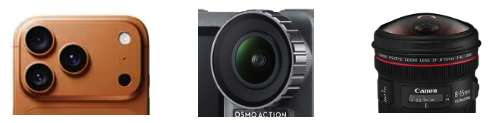
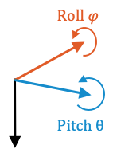

# 📷 UCPE

<p align="center">
<h1 align="center">Unified Camera Positional Encoding for Controlled Video Generation</h1>
<p align="center">
  <p align="center">
    <a href="https://chengzhag.github.io/">Cheng Zhang</a><sup>1</sup><sup>,2</sup>
    ·
    <a href="https://leeby68.github.io/">Boying Li</a><sup>1</sup>
    ·
    <a href="https://www.linkedin.com/in/meng-wei-66687a105/?originalSubdomain=au">Meng Wei</a><sup>1</sup>
    ·
    <a href="https://yanpei.me/">Yan-Pei Cao</a><sup>2</sup>
    ·
    <a href="https://www.monash.edu/mada/architecture/people/camilo-cruz-gambardella/">Camilo Cruz Gambardella</a><sup>1</sup>
    ·
    <a href="https://research.monash.edu/en/persons/dinh-phung/">Dinh Phung</a><sup>1</sup>
    ·
    <a href="https://jianfei-cai.github.io/">Jianfei Cai</a><sup>1</sup><br>
    <sup>1</sup>Monash University <sup>2</sup>VAST
  </p>
  <h2 align="center"><a href="https://arxiv.org/abs/2512.07237">Paper</a> | <a href="https://chengzhag.github.io/publication/ucpe/">Project Page</a> | <a href="https://youtu.be/DogzWyoVBEs">Video</a></h2>
</p>

[](https://youtu.be/DogzWyoVBEs)
*Our UCPE introduces a geometry-consistent alternative to Plücker rays as one of the core contributions, enabling better generalization in Transformers. We hope to inspire future research on camera-aware architectures.

## 🚀 TLDR

🔥 **Camera-controlled text-to-video generation**, now with **intrinsics**, **distortion** and **orientation** control!

<p align="center">
  
  &nbsp; &nbsp; &nbsp; &nbsp; &nbsp; &nbsp;
  
</p>

📷 UCPE integrates **Relative Ray Encoding**—which delivers significantly better generalization than Plücker across diverse camera motion, intrinsics and lens distortions—with **Absolute Orientation Encoding** for controllable pitch and roll, enabling a unified camera representation for Transformers and state-of-the-art camera-controlled video generation with just **0.5% extra parameters** (35.5M over the 7.3B parameters of the base model)

<p align="center">
  
</p>

## 🔔 Coming Soon

- 📁 **PanShot Dataset And Curation Code** (controllable camera data synthesized from [PanFlow](https://github.com/chengzhag/PanFlow))
- 🎯 **Full Training, Evaluation Code** for UCPE

## 🛠️ Installation

```bash
conda create -n UCPE python=3.11 -y
conda activate UCPE
conda install -c conda-forge "ffmpeg<8" libiconv libgl -y
pip install -r requirements.txt
pip install --no-build-isolation --no-cache-dir flash-attn==2.8.0.post2
pip install -e .

cd thirdparty/equilib
pip install -e .
```

## ⚡ Quick Demo

Download our finetuned weights from [OneDrive](https://monashuni-my.sharepoint.com/:f:/g/personal/cheng_zhang_monash_edu/IgCoTNrYOJRJRKtk5A6I1yiCAR9c64-BOrsId5GYsUxE9y4?e=hD26qU) and put it in `logs/` folder. Then run:

```bash
bash scripts/demo.sh
```

The generated videos will be saved in `logs/6wodf04s/demo`, examples shown below:

* `demo/lens.json`: Our **Relative Ray Encoding** not only generalizes to but also enables controllability over a wide range of camera intrinsics and lens distortions.

<p align="center">
  
</p>

* `demo/pose.json`: The geometry-consistent design of **Relative Ray Encoding** further allows strong generalization and controllability over diverse camera motions.

<p align="center">
  
</p>

* `demo/teaser.json`: Our **Absolute Orientation Encoding** further eliminate the ambiguity in pitch and roll in previous T2V methods, enabling precise control over initial camera orientation.

<p align="center">
  
</p>


## 💡 Acknowledgements

Our paper cannot be completed without the amazing open-source projects [Wan2.1](https://github.com/Wan-Video/Wan2.1), [AC3D](https://github.com/snap-research/ac3d), [ReCamMaster](https://github.com/KlingTeam/ReCamMaster), [CameraCtrl](https://github.com/hehao13/CameraCtrl), [prope](https://github.com/liruilong940607/prope), [vllm](https://github.com/vllm-project/vllm), [stella_vslam](https://github.com/stella-cv/stella_vslam)...

Also check out our Pan-Series works [PanFlow](https://github.com/chengzhag/PanFlow), [PanFusion](https://github.com/chengzhag/PanFusion) and [PanSplat](https://github.com/chengzhag/PanSplat) towards 3D scene generation with panoramic images!
